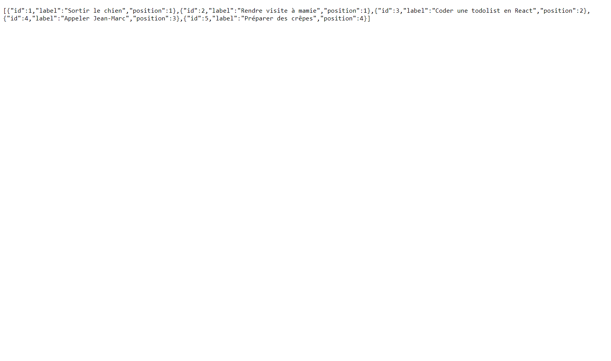

# Hello, voila ma To Do List

Je vous présente ma version de la To do list sous un format Kanban. Les différentes colonnes de l'application représentent les différents status d'avancement possible pour les taches. Le système de drag and drop ayant déjà été vue durant ma formation, j'ai voulu innover avec un système de défilement des taches dans les colonnes.
  

J'ai effectué ce travail en front avec react / redux. Je fais appel à mon serveur grace à une requête Axios dans mon middleware pour me renvoyer quelques exemples de taches et les afficher au premier rendu grâce à un useEffect. Les mapStateToProps et les mapDispatchToProps sont directement dans les components, car à mon sens pour une petite application comme celle-ci cela apporte davantage de lisibilité au code que de passer par des containers en plus des components.
  

J'ai utilisé Sass et de l'écriture BEM dans mes classes pour réaliser quelques petites choses en Css. 
De plus l'application est responsive.

Pour le coté back, le serveur à été construit en Node.js en utilisant Express. Le contenu est simple et à juste pour charge de renvoyer un .json avec une liste de tâches.

****
## Pour démarrer le front:

le front est sur le port localhost:3000  
Après avoir cloné le repo:  
1 => npm i   
2 => npm start  

## Pour démarrer le back:

le back est sur le port localhost:3001  
Après avoir cloné le repo:  
1 => npm i   
2 => npm start  

****
## Résultats:
### Front =>

### Back =>
